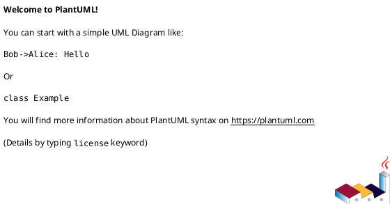

## Bug Description

<!-- A clear and concise description of what the bug is -->

## Steps to Reproduce

<!-- Provide detailed steps to reproduce the behavior -->

1.
2.
3.
4.

## Expected Behavior

<!-- A clear and concise description of what you expected to happen -->

## Actual Behavior

<!-- A clear and concise description of what actually happened -->

## Code Sample

<!-- Provide a minimal code sample that demonstrates the issue -->

```typescript
// Your code here
```

## Environment

<!-- Please complete the following information -->

- **PlantKit Version:** [e.g., 1.0.4]
- **Node.js Version:** [e.g., 22.20.0]
- **npm Version:** [e.g., 10.9.3]
- **Operating System:** [e.g., Ubuntu 24.04, macOS 14, Windows 11]
- **TypeScript Version:** [e.g., 5.7.2]

## Generated Output

<!-- If applicable, include the generated PlantUML output -->



## Error Messages

<!-- If applicable, include any error messages or stack traces -->

```typescript
Error messages here
```

## Additional Context

<!-- Add any other context about the problem here, such as:
- Screenshots
- Related issues
- Workarounds you've tried
- Impact on your project
-->

## Possible Solution

<!-- Optional: If you have suggestions on how to fix the bug -->
