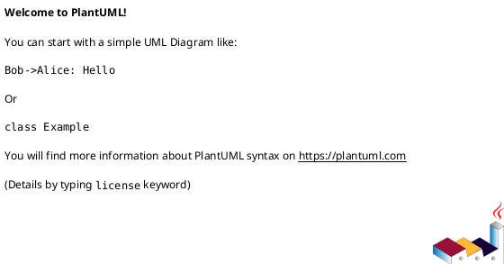

## Feature Description

<!-- A clear and concise description of the feature you'd like to see -->

## Problem Statement

<!-- Describe the problem this feature would solve -->
<!-- Example: "I'm always frustrated when..." or "It's difficult to..." -->

## Proposed Solution

<!-- Describe how you envision this feature working -->

## Example Usage

<!-- Provide code examples showing how this feature would be used -->

```typescript
// Example of how the feature would work
```

## Expected Output

<!-- If applicable, show what the generated PlantUML would look like -->



## Use Cases

<!-- Describe specific use cases where this feature would be valuable -->

1.
2.
3.

## Alternatives Considered

<!-- Describe alternative solutions or features you've considered -->

## ArchiMate Compliance

<!-- If this relates to ArchiMate specification, provide references -->

- [ ] This feature is part of ArchiMate 3.x specification
- [ ] Reference: [Link to ArchiMate documentation]

## Additional Context

<!-- Add any other context, screenshots, or examples about the feature request -->

## Implementation Suggestions

<!-- Optional: If you have ideas about how to implement this feature -->

## Breaking Changes

<!-- Would this feature require breaking changes? -->

- [ ] Yes, this would require breaking changes
- [ ] No, this can be added without breaking existing functionality

## Priority

<!-- How important is this feature to you? -->

- [ ] Critical - Blocking my work
- [ ] High - Would significantly improve my workflow
- [ ] Medium - Nice to have
- [ ] Low - Minor improvement
